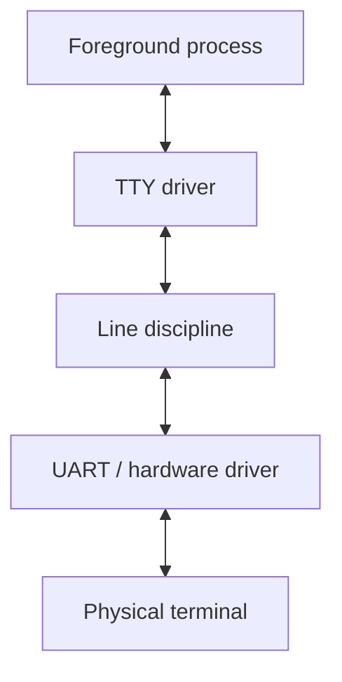
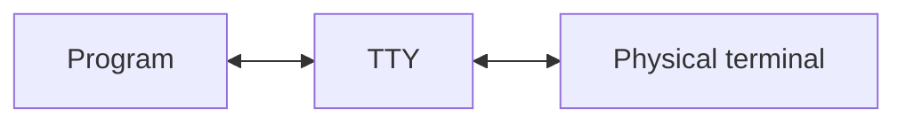
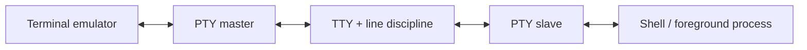
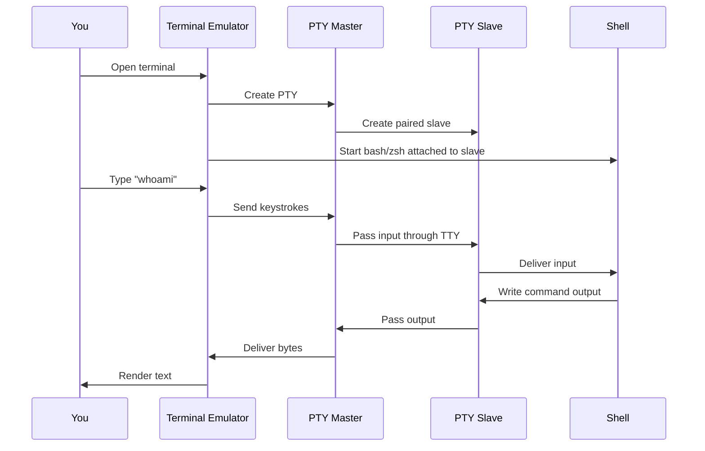
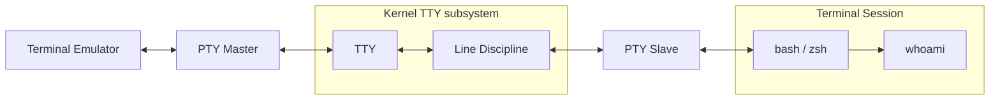
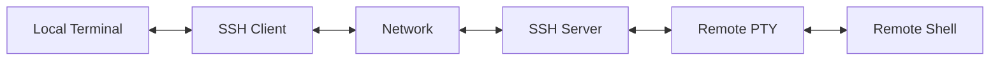
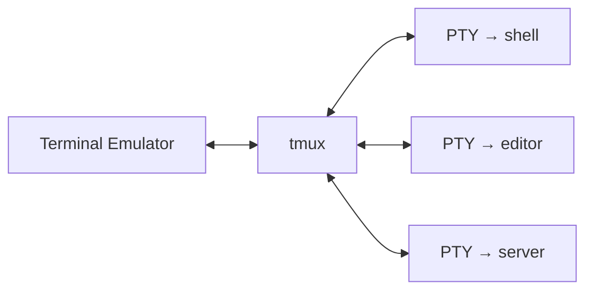
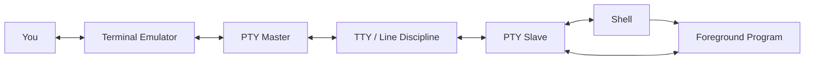

# What Actually Happens When You Open a Terminal?

Most developers use a terminal every day.

We open one, type something like:

```
whoami
```

and get an answer.

Simple enough.

But what actually happened?

What is the black window we're typing into? Is it the shell? Is it a terminal? What's a TTY? Why does Linux have files such as /dev/tty and /dev/pts/0? And where does something called a _pseudo-terminal_ fit into all of this?

The answers involve a surprisingly long chain of abstractions stretching from physical teletypes to the terminal emulator sitting on your laptop today.

Let's follow that chain.

---

## First: What Is a Terminal?

Today, when someone says "open a terminal," they're usually talking about an application that looks something like this:

```text
┌────────────────────────────────────────────┐
│ $ whoami                                    │
│ alex                                        │
│ $ _                                         │
│                                              │
└────────────────────────────────────────────┘
```

Terminal.app, iTerm2, GNOME Terminal, Windows Terminal, and the terminal embedded in VS Code are all examples.

But historically, a _terminal was an actual piece of hardware_.

It was the thing sitting at the end—the _terminal_—of a connection to a computer.

Early terminals were essentially keyboards and printers connected to a larger machine. Later, printers gave way to screens, producing the recognizable keyboard-and-monitor terminals associated with early computing.

The important part is that the terminal and the computer running your programs were separate things.

That distinction still exists today.

We've just replaced the physical terminal with software.

---

## Enter the TTY

You'll frequently encounter the abbreviation _TTY_ when digging into Unix terminals.

TTY stands for _teletypewriter_.

That name makes considerably more sense once you know the history: Unix was originally designed to communicate with physical terminal devices derived from teletypes.

A simplified version of the original architecture looked something like this:



The operating system didn't simply throw characters directly between a process and a keyboard.

There was an abstraction in the middle.

The _TTY subsystem_ handled communication between programs and terminal hardware.

And one particularly important component was the _line discipline_.

---

## The Line Discipline: The Invisible Middleman

Imagine typing:

```
hello
```

A program doesn't necessarily receive five individual characters the instant you press them.

Traditionally, the terminal's line discipline can collect and process that input first.

This is where familiar terminal behavior comes from.

For example:

- Backspace can erase a character.
- Ctrl+C can interrupt a process.
- Ctrl+Z can suspend a process.
- Input can be buffered until you press Enter.
- Typed characters can be echoed back onto the screen.

So the TTY isn't merely a pipe carrying bytes around.

It implements behavior.

One especially important distinction is between _canonical mode_ and _raw mode_.

In canonical mode, input is generally processed a line at a time:

```text
h e l l o [Enter]
↓
application
```

In raw mode, applications can receive input much more directly.

Interactive programs such as editors, shells, TUIs, and terminal games rely heavily on this distinction.

---

## But We Don't Have Teletypes Anymore

Here's where things get interesting.

Modern laptops don't have a teletype plugged into a serial port.

Our "terminal" is an application running on the same computer as our shell.

Yet Unix software was built around the TTY abstraction, and that abstraction turned out to be extremely useful.

So rather than throw it away, operating systems virtualized it.

The result is the _PTY_, or _pseudo-terminal_.

---

# PTYs: Pretending There's Still a Physical Terminal

A pseudo-terminal is essentially a software implementation of the old terminal relationship.

Instead of this:



we can do this:



A PTY comes as a pair:

_PTY master_

The terminal emulator controls this side.

_PTY slave_

Programs inside the terminal session interact with this side as though it were a real terminal.

That's the trick.

From the shell's point of view, it still has a terminal.

It doesn't particularly care that the "hardware terminal" on the other end is actually another process drawing pixels into a GUI window.

---

## Opening a Modern Terminal

Suppose you open your favorite terminal application.

Conceptually, something like this happens:



This distinction is important:

Your terminal emulator and your shell are not the same program.

Your terminal emulator might be Terminal.app, iTerm2, GNOME Terminal, or something similar.

Your shell might be:

```
bash
```

or:

```
zsh
```

or:

```
fish
```

The terminal emulator provides the terminal.

The shell is simply a process running inside that terminal session.

---

## What Happens When We Run whoami?

Now let's add another process.

You type:

```
whoami
```

Your shell interprets that command and starts the whoami program.

Conceptually, we now have something like:



The shell and whoami belong to the same terminal session.

While whoami is running, it becomes the _foreground process_ for that terminal.

Its standard input, output, and error streams ultimately connect back through the PTY.

So when whoami writes:

```text
alex
```

those bytes travel roughly like this:

```text
whoami
↓
PTY slave
↓
TTY subsystem
↓
PTY master
↓
terminal emulator
↓
pixels on your screen
```

Input travels in the opposite direction.

---

## You Can See This Yourself

On Unix-like systems, try:

```
tty
```

You may get something like:

```text
/dev/pts/3
```

That is the terminal associated with your current process.

Now try:

```
ps
```

or:

```
ps -f
```

You'll often see a TTY associated with the processes in your terminal session.

You can also inspect pseudo-terminal devices directly:

```
ls -l /dev/pts
```

On Linux, /dev/pts contains the slave sides of active pseudo-terminals.

Open another terminal window and run the command again. You may see another PTY appear.

This is the operating-system abstraction underneath the windows and tabs you're interacting with.

---

## Sessions and Foreground Processes

There's another piece of the terminal model that explains a lot of otherwise mysterious shell behavior: _sessions and process groups_.

A terminal isn't simply connected to one process forever.

Consider this:

```
sleep 100
```

Your shell launches sleep.

While it is running, sleep becomes part of the foreground process group.

Press:

```text
Ctrl+C
```

and the terminal doesn't literally send the characters ^ and C to sleep.

The TTY subsystem recognizes the control sequence and generates a signal—typically `SIGINT`—for the foreground process group.

Likewise:

```text
Ctrl+Z
```

normally results in a suspend signal.

That's why these shortcuts work consistently across many different command-line programs.

The behavior isn't implemented independently by every application. Much of it comes from the terminal abstraction itself.

---

## This Also Explains SSH

Once you understand PTYs, tools such as SSH become easier to reason about.

When you run:

```
ssh server.example.com
```

SSH can allocate a pseudo-terminal on the remote machine.

Conceptually:



Your shell is running on another computer, but it still believes it's connected to a terminal.

SSH transports the terminal input and output over the network.

The abstraction survives.

---

## And Terminal Multiplexers

The same idea helps explain tools like tmux and screen.

A terminal multiplexer sits between your terminal and your programs.

Very roughly:



tmux can maintain those pseudo-terminal sessions even when your actual terminal emulator disconnects.

That's why you can:

1. SSH into a server.
2. Start tmux.
3. Launch a long-running program.
4. Lose your SSH connection.
5. Reconnect later.
6. Reattach to the same session.

The processes weren't fundamentally attached to the pixels on your laptop.

They were attached to pseudo-terminals managed by tmux.

---

## Why Programs Behave Differently When Piped

There's one final consequence of all this that developers run into surprisingly often.

Programs can ask:

Is my output connected to a terminal?

For example, many commands enable colors when writing to a TTY but disable them when output is redirected.

Compare:

```
some-command
```

with:

```
some-command > output.txt
```

or:

```
some-command | another-command
```

In the first case, stdout may be attached to a terminal.

In the others, it may be attached to a file or pipe.

Programs can detect the difference.

That's why you sometimes see flags such as:

```
--color=always
```

or environment variables that force terminal-like behavior.

It's also why automation sometimes behaves differently from running the exact same command interactively.

A CI job, container, subprocess, or remote execution environment may not have a PTY at all.

---

# The Mental Model

If you remember only one thing, remember this:



The terminal window is _not your shell_.

The shell is _not the terminal_.

And the program you're running is usually another process again.

The PTY and TTY subsystem connect those pieces while preserving an interface designed decades ago for physical terminal hardware.

---

## An Abstraction That Refused to Die

The terminology around terminals can feel unnecessarily confusing because we're using words invented for hardware that most developers have never seen.

_Terminal. TTY. Line discipline. PTY master. PTY slave._

They sound like historical artifacts because they are.

But the underlying abstraction turned out to be remarkably durable.

We replaced physical teletypes with video terminals.

Then we replaced video terminals with terminal emulators.

We added remote connections, terminal multiplexers, containers, IDEs, and cloud development environments.

And through all of it, programs could continue interacting with something that looked remarkably like the terminal interface Unix had provided all along.

So the next time you open a terminal and type:

```
whoami
```

there's considerably more happening than a black rectangle executing a command.

There's a terminal emulator talking to one half of a pseudo-terminal, a kernel TTY subsystem providing decades-old terminal semantics, a shell managing a session and its processes, and finally your tiny whoami process writing bytes back through the entire stack.

All so the terminal can tell you who you are.
